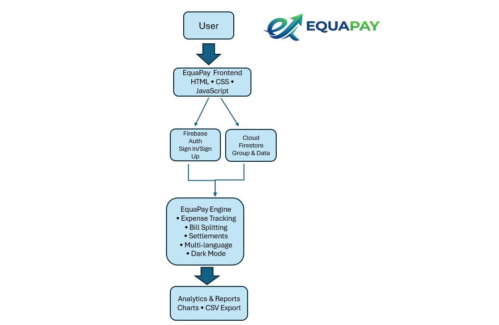

# EquaPay
EPL Project
<br>
CodeWarriors
<br>
> A smart and simple solution for managing shared expenses.

---

## 👥 Team CodeWarriors

- Umme Hafsa
- Disha Vyas
- Sania Noorin
- Syeda Sidra Fatima

---

# EquaPay 💸
"EquaPay — Payments Made Fair and Simple".
## 📌 Product Overview

## 📑 Table of Contents

- Application Preview
- UN SDG Alignment
- Features
- Technologies Used
- Project Structure
- System Architecture
- Project Highlights
- Installation Guide
- Error Handling
- Development Journey
- Future Improvements
- Contributors
- License

  ---
  
## 📸 Application Preview

-Dashboard


- Add expense


---


## 🌍 UN SDG Alignment

## ✨ Features

## 🛠️ Tech Stack

## 🧱 System Architecture

## 📂 Project Structure

## ⚙️ Installation Guide

## 🚀 Running the Project

## 🔐 Security Model

## ✨ Feature Breakdown

## ⚡ Performance Optimization

## 🛡️ Error Handling & Validation

## 🚀 Development Journey

## 🔮 Future Improvements

##  📸 Final Gallery

## 👥 Team Members

## 📜 License


## 📌 Project Overview
EquaPay 💸


“Because friendships should not break over ₹143.50.”
EquaPay helps users manage and divide shared expenses efficiently among friends, roommates, and teams.  
The platform simplifies bill splitting, balance tracking, and payment management with a clean and user-friendly interface.
Managing shared expenses in groups is often confusing and stressful. Whether it’s a college trip, hostel expenses, team lunch, or apartment rent, people struggle to calculate who owes whom.

EquaPay solves this problem by providing an easy-to-use expense splitting platform where users can:

* Create groups
* Add members
* Record expenses
* Automatically split amounts equally
* Track balances
* Reduce payment confusion

The application ensures fairness, transparency, and convenience in managing group finances.

Our goal is to simplify collaborative spending and eliminate awkward money conversations between friends and teammates.

---

This project supports:
## 🌍 UN Sustainable Development Goals (SDG) Alignment

### SDG 9 — Industry, Innovation and Infrastructure

EquaPay uses digital financial technology to simplify collaborative expense management through automation and smart calculations.

### SDG 10 — Reduced Inequalities

The application promotes financial transparency and fairness by ensuring every group member contributes equally and accurately.

### SDG 16 — Peace, Justice and Strong Institutions

Money-related misunderstandings are a common source of conflict in groups. EquaPay helps maintain trust and accountability by clearly tracking transactions and balances.

---


## ✨ Features


- 👥 Group creation and management
- 💰 Expense tracking
- ⚖️ Automatic equal splitting
- 📊 Balance calculation
- 🛡️ Input validation
- ❌ Negative amount prevention
- 📱 Clean and responsive UI
- 🔄 Real-time updates

- ✅ User Authentication (Email & Google Sign-In)
- ✅ Expense Tracking
- ✅ Smart Bill Splitting (Equal, Percentage, Exact & Share Based)
- ✅ Real-Time Balance Calculation
- ✅ Group Management
- ✅ Expense Categories
- ✅ Payment Method Tracking
- ✅ Expense Notes & Receipts
- ✅ Settlement Tracking
- ✅ Analytics Dashboard
- ✅ CSV Export
- ✅ Multi-Language Support
- ✅ Dark Mode
- ✅ Email Verification
- ✅ Password Reset
- ✅ Responsive Design

---

## 🔄 Expense Workflow

```text
User Login
↓
Create Group
↓
Add Expense
↓
Choose Split Method
↓
Calculate Balances
↓
Track Settlements
↓
View Analytics
```


---

## 🛠️ Technologies Used

| Technology | Purpose |

### Frontend
- React.js
- HTML5
- CSS3
- JavaScript
=======
|------------|---------|
| HTML5 | Structure |                                                                      
| CSS3 | Styling |                                                    
| JavaScript | Frontend Logic |
| Firebase Authentication | User Login & Security |
| Cloud Firestore | Database Storage |
| Chart.js | Analytics & Visualizations |
| GitHub | Version Control |


### Backend
- Node.js
- Firebase

### Database
- PostgreSQL
- Firestore

### Tools & Platforms
- GitHub
- VS Code
- Figma
- Canva
---

## 📂 Project Structure

```bash
EquaPay/
│── index.html
│── style.css
│── script.js
│── backend.js
│── logo.png
│── README.md
│── images/
```


---
## ⚙️ Installation Guide

### 1️⃣ Clone the Repository

```bash
git clone https://github.com/YOUR_USERNAME/equapay.git
```

### 2️⃣ Navigate into Project Folder

```bash
cd equapay
```

### 3️⃣ Install Frontend Dependencies

```bash
cd frontend
npm install
```

### 4️⃣ Install Backend Dependencies

```bash
cd ../backend
npm install
```

### 5️⃣ Configure Environment Variables

Create a `.env` file inside the backend folder and add:

```env
PORT=5000
DATABASE_URL=your_database_url
```

### 6️⃣ Start Backend Server

```bash
npm run dev
```

### 7️⃣ Start Frontend

```bash
cd ../frontend
npm start
```

The application should now run locally on:

```txt
http://localhost:3000
```


## 🏗️ System Architecture



---

### Architecture Flow

```text
User
↓
Frontend (HTML, CSS, JavaScript)
↓
Firebase Authentication
↓
Cloud Firestore Database
↓
Analytics Dashboard & Expense Management
```

---

## 🌟 Project Highlights

- Real-time expense synchronization using Firebase
- Multiple bill splitting methods
- Secure user authentication
- Interactive analytics dashboard
- Dark mode support
- Multi-language support
- EquaPay combines modern web technologies with secure cloud-based services to provide a seamless expense-sharing experience.

---

## 🚀 How to Run the Project

1. Clone the repository

```bash
git clone https://github.com/sidrafatima-bot/equapay.git
```

2. Open the project folder

3. Run `index.html` in your browser

---

## 🔐 Security Model

EquaPay follows a secure and reliable architecture to protect user data and maintain application integrity.

### Authentication & Access Control

* Secure API communication between frontend and backend
* Environment variables used for sensitive credentials
* Database access restricted through backend APIs only
* Input validation implemented on both frontend and backend

### Data Validation

To prevent invalid or harmful data from entering the system, the application validates:

* Empty fields
* Negative expense amounts
* Invalid numeric inputs
* Missing required parameters

### Error Protection

The backend uses structured error handling with `try-catch` blocks to prevent application crashes and improve debugging.

### Secure Environment Variables

Sensitive configuration values such as database URLs and API credentials are stored securely inside `.env` files and are excluded from public repositories using `.gitignore`.

### Future Security Enhancements

* JWT Authentication
* Password encryption using bcrypt
* Rate limiting
* Role-based access control
* HTTPS deployment
* Multi-factor authentication
## ✨ Feature Breakdown

### 👥 Group Management

Users can create groups for trips, hostel expenses, roommates, events, or team activities.

### 💸 Expense Tracking

Members can add expenses with details such as:

* Expense title
* Amount
* Paid by
* Split participants

### ⚖️ Automatic Expense Splitting

The system automatically calculates equal shares among selected members, reducing manual calculations and mistakes.

### 📊 Balance Calculation

EquaPay calculates:

* Total group spending
* Individual contributions
* Pending balances
* Who owes whom

## ⚡ Performance Optimization

EquaPay is designed with performance and efficiency in mind to provide a smooth user experience.

### Optimized Frontend Rendering

* Reusable React components reduce unnecessary rendering
* Efficient state management improves UI responsiveness
* Minimal and clean interface design improves loading speed

### Backend Optimization

* Lightweight REST APIs built using Express.js
* Efficient routing structure for faster request handling
* Organized controller-based architecture for maintainability

### Database Efficiency

* PostgreSQL provides reliable and scalable data handling
* Optimized queries reduce unnecessary database load
* Structured schemas improve data retrieval performance

### Reduced API Overhead

The application minimizes redundant API calls by:

* Updating only required components
* Using proper asynchronous operations
* Handling requests efficiently with async-await

### Error Recovery & Stability

Robust error handling ensures:

* Better system stability
* Prevention of server crashes
* Improved debugging and maintenance

### Future Optimization Plans

* Redis caching
* Lazy loading
* Pagination for large transaction history
* Real-time WebSocket synchronization
* Cloud deployment with CDN support

### 🛡️ Validation & Error Handling

The application prevents:

* Negative amounts
* Empty submissions
* Invalid API requests
* Incorrect user inputs

### 🔄 Real-Time Data Updates

Updated expenses and balances are reflected immediately across the interface for a smooth collaborative experience.

### 📱 Responsive User Interface

The frontend is designed to work across desktops, tablets, and mobile devices for better accessibility.

### 🧾 Transaction Transparency

Every group member can clearly view:

* Expense history
* Shared contributions
* Settlement information

This improves accountability and avoids misunderstandings between users.


## 🛡️ Error Handling & Validation

Example:

:::writing{variant="document" id="91426"}
## 🛡️ Error Handling & Validation

EquaPay includes robust validation and error handling mechanisms to ensure smooth user experience and prevent invalid data.

### Implemented Validations

- Prevents negative expense amounts
- Blocks empty input fields
- Handles invalid API requests
- Displays user-friendly error messages
- Uses try-catch blocks for backend safety

### Example Validation

```javascript
if(amount <= 0){
   return res.status(400).json({
      error: "Amount must be greater than zero"
   });
}
---
<<<<<<< HEAD
```
## 🚀 Development Journey

The development of EquaPay was completed through a structured engineering workflow over multiple stages.This app was built for a junior-level technical competition conducted by our college. Every week, we attempted a series of given challenges that are showcased here:

Week 1: The Blueprint Blitz
1. The Rough Draft: A summary of our initial plan for the project was drafted. Summary
2. The Tech Justification: We researched and finalized our tech stack. Tech Stack
3. The Logic Flow Architecture: We created a simple wireframe to exhibit our idea. Wireframe

Week 2: The Deployment Powerplay
1. The Motivation Track: https://open.spotify.com/playlist/56wH7n2rRe2hijdbgEIfRp?si=1f74ba8fc17544e7
2. The Repo Setup: Hence, this repository was made!
3. The UI/Circuit Milestone: A screenshot of the initial UI was shared.
4. The Heart of The Project: A demo video showcasing our initial build was created. 

Week 3: The Impact & Refinement Phase
1.The Code Meme & Team Identity: A light-hearted round spent making meme collages. memes
2. The Global Impact Mapping: An identification of the global impact our project contributed to was drafted. SDG goals
3. The Core Error-Handling: We proved our code can handle chaotic user input, and dealt with edge cases. Error Handling
4. The Optimization Milestone: We optimized our app to run faster, and added various quality-of-life features.

Week 4: The Final Integration (Clean Code & Complete Documentation)
1. The Code Contribution & Cleanup Check: We pushed all of our code to our repository and merged our branches, finalizing our project at last.
2. The “Shark Tank” Pitch Tagline & Poster: A simple poster to pitch our project was created. Poster
3. The SDLC Lifecycle Mapping: A document of our build journey was drafted. SDLC Lifecycle Report
4. The Production-Ready Technical README: The README.md file was finalized.


### Key Challenges Faced

* Backend-database connection setup
* Handling API errors properly
* Managing expense calculations accurately
* Structuring project folders efficiently

### Skills Learned
Through this project, the team gained practical experience in:

* Full-stack web development
* API integration
* Database management
* GitHub collaboration
* Debugging and testing
* Software documentation
=======
## Development Journey

This app was built for a junior-level technical competition conducted by our college. Every week, we attempted a series of given challenges that are showcased here:

Week 1: The Blueprint Blitz

1.The Rough Draft: A summary of our initial plan for the project was drafted. Summary

2.The Tech Justification: We researched and finalized our tech stack. Tech Stack

3.The Logic Flow Architecture: We created a simple wireframe to exhibit our idea. Wireframe

Week 2: The Deployment Powerplay

1.The Motivation Track: https://open.spotify.com/playlist/56wH7n2rRe2hijdbgEIfRp?si=1924d6b23c2d4921

2.The Repo Setup: Hence, this repository was made!

3.The UI/Circuit Milestone: A screenshot of the initial UI was shared.

4.The Heart of The Project: A demo video showcasing our initial build was created. Demo

Week 3: The Impact & Refinement Phase

1.The Code Meme & Team Identity: A light-hearted round spent making meme collages. memes

2.The Global Impact Mapping: An identification of the global impact our project contributed to was drafted. SDG goals

3.The Core Error-Handling: We proved our code can handle chaotic user input, and dealt with edge cases. Error Handling

4.The Optimization Milestone: We optimized our app to run faster, and added various quality-of-life features. Demo

Week 4: The final integration(clean code & complete documentation)

1.The Code Contribution & Cleanup Check: We pushed all of our code to our repository and merged our branches, finalizing our project at last.

2.The “Shark Tank” Pitch Tagline & Poster: A simple poster to pitch our project was created. Poster

3.The SDLC Lifecycle Mapping: A document of our build journey was drafted. SDLC Lifecycle Report

4.The Production-Ready Technical README: The README.md file was finalized.

>>>>>>> ef5ddf71e2f27c2094ad916c26b9e491ffa42c71

## 📈 Future Improvements

- AI-powered spending insights
<<<<<<< HEAD
- Multi-currency support
- UPI integration
- Expense analytics dashboard
- Real-time notifications
- Mobile application
=======
- Mobile Application
- Payment Gateway Integration
- OCR Receipt Scanning
- Multi-Currency Auto Conversion
- Group Invite Links

>>>>>>> ef5ddf71e2f27c2094ad916c26b9e491ffa42c71
---
## 📸 Final Gallery
    - welcome-page
      

    - login/sign in page
      

    - Dashboard page
      

    - create group page
      

    - add expense page
      

     - Settlement page
       

     - Analytics page
        

      - Settings page
      

      - Flowchart page
      


## 🤝 Contributors

<<<<<<< HEAD
Team CodeWarriors
@UmmeHafsa3191
@sidrafatima-bot
@dishavyas55
@sanianoorin-ctrl
=======
All members of Team CodeWarriors contributed to the design, development, testing, and documentation of EquaPay.
>>>>>>> ef5ddf71e2f27c2094ad916c26b9e491ffa42c71

---

## 📜 License
MIT License

<<<<<<< HEAD
This project is created for educational and innovation purposes-— feel free to use, modify, and distribute this project with proper attribution.
This project is licensed under the MIT License.
Permission is granted to use, modify, and distribute this software for educational and personal purposes.
For more details, refer to the LICENSE file.
© 2026 EquaPay Team

=======
Copyright (c) 2026 EquaPay Team

Permission is hereby granted, free of charge, to any person obtaining a copy
of this software and associated documentation files (the "Software"), to deal
in the Software without restriction, including without limitation the rights
to use, copy, modify, merge, publish, distribute, sublicense, and/or sell
copies of the Software.
>>>>>>> ef5ddf71e2f27c2094ad916c26b9e491ffa42c71
