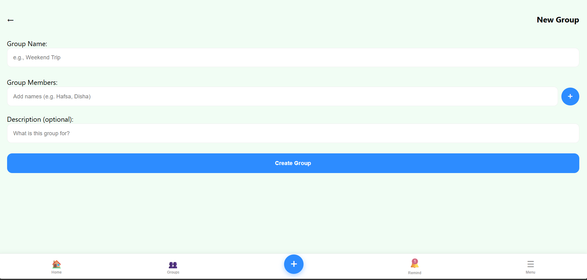

# EquaPay
EPL Project
<br>
CodeWarriors
<br>
> A smart and simple solution for managing shared expenses.

---

## 👥 Team CodeWarriors

- Umme Hafsa
- Disha Vyas
- Sania Noorin
- Syeda Sidra Fatima

---

## 📌 Project Overview

EquaPay helps users manage and divide shared expenses efficiently among friends, roommates, and teams.  
The platform simplifies bill splitting, balance tracking, and payment management with a clean and user-friendly interface.

---
## 📸 Application Preview




---

## 🌍 UN SDG Alignment

This project supports:

### SDG 9 – Industry, Innovation and Infrastructure

By promoting:
- Digital financial collaboration
- Smart financial management
- Accessible technology solutions

---

## ✨ Features

- ✅ User Authentication (Email & Google Sign-In)
- ✅ Expense Tracking
- ✅ Smart Bill Splitting (Equal, Percentage, Exact & Share Based)
- ✅ Real-Time Balance Calculation
- ✅ Group Management
- ✅ Expense Categories
- ✅ Payment Method Tracking
- ✅ Expense Notes & Receipts
- ✅ Settlement Tracking
- ✅ Analytics Dashboard
- ✅ CSV Export
- ✅ Multi-Language Support
- ✅ Dark Mode
- ✅ Email Verification
- ✅ Password Reset
- ✅ Responsive Design

---

## 🛠️ Technologies Used

| Technology | Purpose |
|------------|---------|
| HTML5 | Structure |
| CSS3 | Styling |
| JavaScript | Frontend Logic |
| Firebase Authentication | User Login & Security |
| Cloud Firestore | Database Storage |
| Chart.js | Analytics & Visualizations |
| GitHub | Version Control |

---

## 📂 Project Structure

```bash
EquaPay/
│── index.html
│── style.css
│── script.js
│── backend.js
│── logo.png
│── README.md
│── images/
```

---

## 🏗️ System Architecture


---

### Architecture Flow

```text
User
↓
Frontend (HTML, CSS, JavaScript)
↓
Firebase Authentication
↓
Cloud Firestore Database
↓
Analytics Dashboard & Expense Management
```

---

## 🌟 Project Highlights

- Real-time expense synchronization using Firebase
- Multiple bill splitting methods
- Secure user authentication
- Interactive analytics dashboard
- Dark mode support
- Multi-language support
- EquaPay combines modern web technologies with secure cloud-based services to provide a seamless expense-sharing experience.

---

## 🚀 How to Run the Project

1. Clone the repository

```bash
git clone https://github.com/sidrafatima-bot/equapay.git
```

2. Open the project folder

3. Run `index.html` in your browser

---

## 🛡️ Error Handling

The project safely handles:
- Empty input fields
- Invalid values
- Incorrect calculations
- Responsive fallback behavior

---

## 📈 Future Improvements

- AI-powered spending insights
- Mobile Application
- Payment Gateway Integration
- OCR Receipt Scanning
- Multi-Currency Auto Conversion
- Group Invite Links

---

## 🤝 Contributors

All members of Team CodeWarriors contributed to the design, development, testing, and documentation of EquaPay.

---

## 📜 License

This project was developed by Team CodeWarriors as part of the EPL Project and is intended for educational and demonstration purposes.
